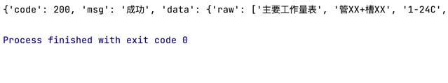

# chineseocr_lite 的 onnx 推理, 部署简单
优化返回结果，返回一个字典，内容如下：
  

## 环境
- python3.7

- linux/macos/windows

## 使用方式
1、安装依赖文件requirements  
``` Bash
pip install -r requirements.txt
```
2、运行服务，可在服务器端运行 
``` Bash
python backend/main.py 
```
3、api请求： 
``` Bash
python API请求demo.py 
```
提示：在config.py中可以编辑配置文件。  
如果api请求不成功，请自行修改API请求demo中的ip，改成本机IP。


